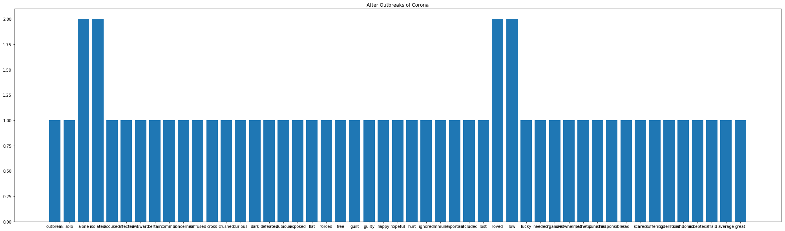

*[Sentiment Analysis on Before outbreak COVID and After Outbreak COVID  :Project Overview](https://github.com/Surekha-honey/Deep-Learning-Projects/blob/master/NLP%20sentiment%20analysis/Sentiment%20Analysis%20on%20Cornavirus%20after%20outbreak%20and%20before%20outbreak.ipynb)*

 Main goal of this project to analyse people's sentiment in different situations before Coronavirus Outbreak and after Coronavirus Outbreak .
 * Analysing People's sentiment in different Situations by using Text.
 * Data has been collected from twitter through GetOldTweet library i.e Scrapping ..
 * Text data has been processed by implementing different cleansing techniques in NLP.
## Code and Resources Used :
* Python Version : 3.7
* Packages: pandas, numpy,NLTK,matplotlib,

## Visualizations 

